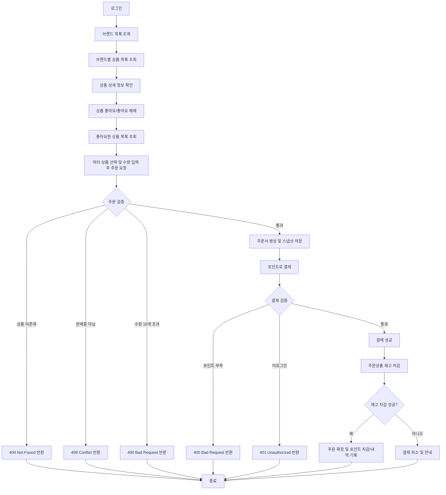
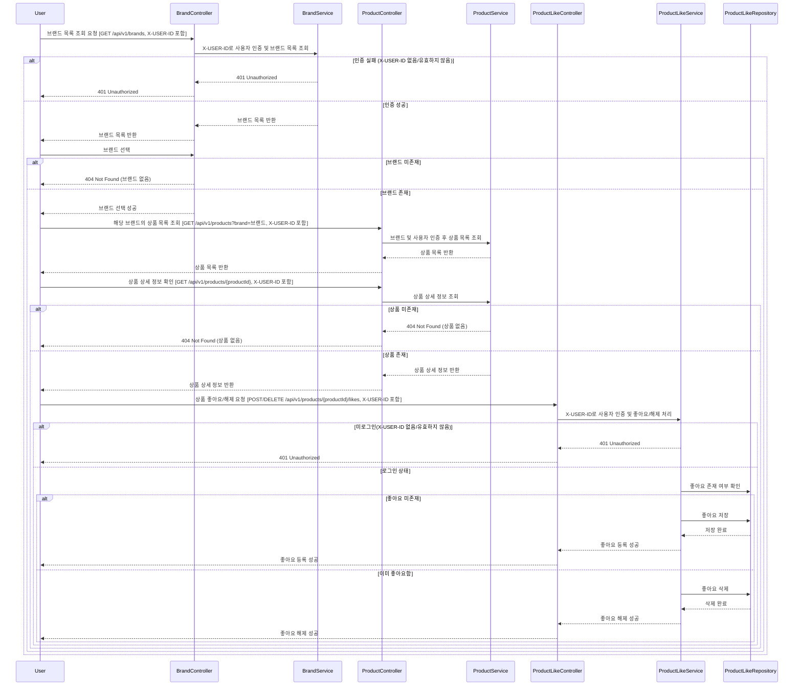
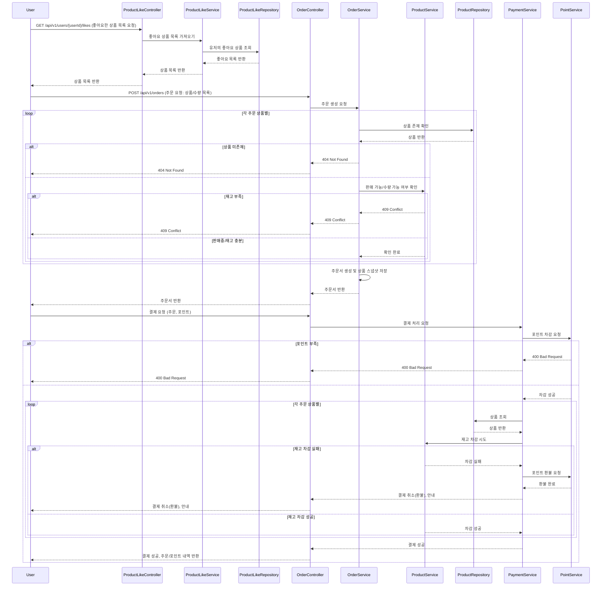

# 유저 플로우 (플로우 차트)

---

# 주요 유저 플로우 - 시퀀스 다이어그램

---

## 1. 브랜드 및 상품 탐색 플로우

1. 사용자는 로그인한다.

2. 브랜드 목록을 조회한다.

   - 실패: 인증 헤더 없음 → 401 Unauthorized

3. 브랜드를 선택한다.

   - 실패: 브랜드 미존재 → 404 Not Found

4. 선택한 브랜드의 상품 목록을 조회한다.

5. 관심 있는 상품을 선택해 상세 정보를 확인한다.

   - 실패: 상품 미존재 → 404 Not Found

6. 사용자는 상품 상세 페이지에서 좋아요를 누른다.

   - 실패: 미로그인 → 401 Unauthorized

7. 이미 좋아요를 누른 상품이면 좋아요가 해제된다.

## 2. 좋아요 상품 주문 플로우

1. 사용자는 “좋아요한 상품 목록”을 조회한다.

2. 주문할 상품(복수 선택 가능)을 선택한다.

3. 각 상품별로 수량을 선택한다.

   - 실패: 상품 미존재 → 404 Not Found

   - 실패: 주문 수량이 재고 초과 → 409 Conflict

   - 실패: 상품이 판매중 상태가 아님 → 409 Conflict

4. 주문서를 생성한다.

   - 주문 시점의 상품 정보(이름, 가격, 수량 등)는 스냅샷으로 저장됨.

5. 결제 화면으로 이동한다.

6. 포인트로 주문 전체 금액을 결제한다.

   - 실패: 포인트 부족 → 400 Bad Request

   - 실패: 미로그인 → 401 Unauthorized

7. 결제 성공 시, 각 상품별 재고를 차감한다.

   - 실패: 결제 성공 후 재고 부족 확인 → 결제 취소(환불) 및 안내, 409 Conflict 또는 500 Internal Server Error

8. 결제 및 주문 내역, 포인트 사용 내역이 기록된다.

