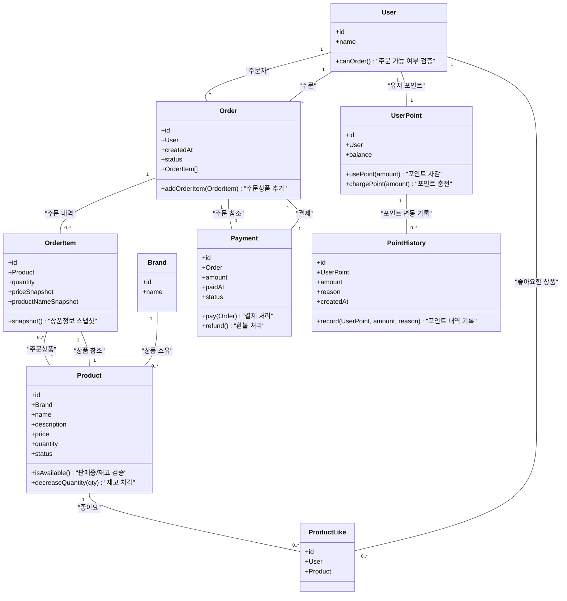

# 클래스다이어그램

---

```mermaid
classDiagram
    class User {
        +id
        +name
        +canOrder() "주문 가능 여부 검증"
    }

    class UserPoint {
        +id
        +User
        +balance
        +usePoint(amount) "포인트 차감"
        +chargePoint(amount) "포인트 충전"
    }

    class Brand {
        +id
        +name
    }

    class Product {
        +id
        +Brand
        +name
        +description
        +price
        +quantity
        +status
        +isAvailable() "판매중/재고 검증"
        +decreaseQuantity(qty) "재고 차감"
    }

    class ProductLike {
        +id
        +User
        +Product
    }

    class Order {
        +id
        +User
        +createdAt
        +status
        +addOrderItem(OrderItem) "주문상품 추가"
        +OrderItem[]
    }

    class OrderItem {
        +id
        +Product
        +quantity
        +priceSnapshot
        +productNameSnapshot
        +snapshot() "상품정보 스냅샷"
    }

    class Payment {
        +id
        +Order
        +amount
        +paidAt
        +status
        +pay(Order) "결제 처리"
        +refund() "환불 처리"
    }

    class PointHistory {
        +id
        +UserPoint
        +amount
        +reason
        +createdAt
        +record(UserPoint, amount, reason) "포인트 내역 기록"
    }

    %% 관계 정의 (한글 설명)
    User "1" -- "1" UserPoint : "유저 포인트"
    User "1" -- "0..*" ProductLike : "좋아요한 상품"
    User "1" -- "0..*" Order : "주문"

    Order "1" -- "1" User : "주문자"
    Order "1" -- "0..*" OrderItem : "주문 내역"
    Order "1" -- "1" Payment : "결제"

    UserPoint "1" -- "0..*" PointHistory : "포인트 변동 기록"

    Brand "1" -- "0..*" Product : "상품 소유"

    Product "1" -- "0..*" ProductLike : "좋아요"
    Product "1" -- "0..*" OrderItem : "주문상품"

    OrderItem "1" -- "1" Product : "상품 참조"

    Payment "1" -- "1" Order : "주문 참조"
```