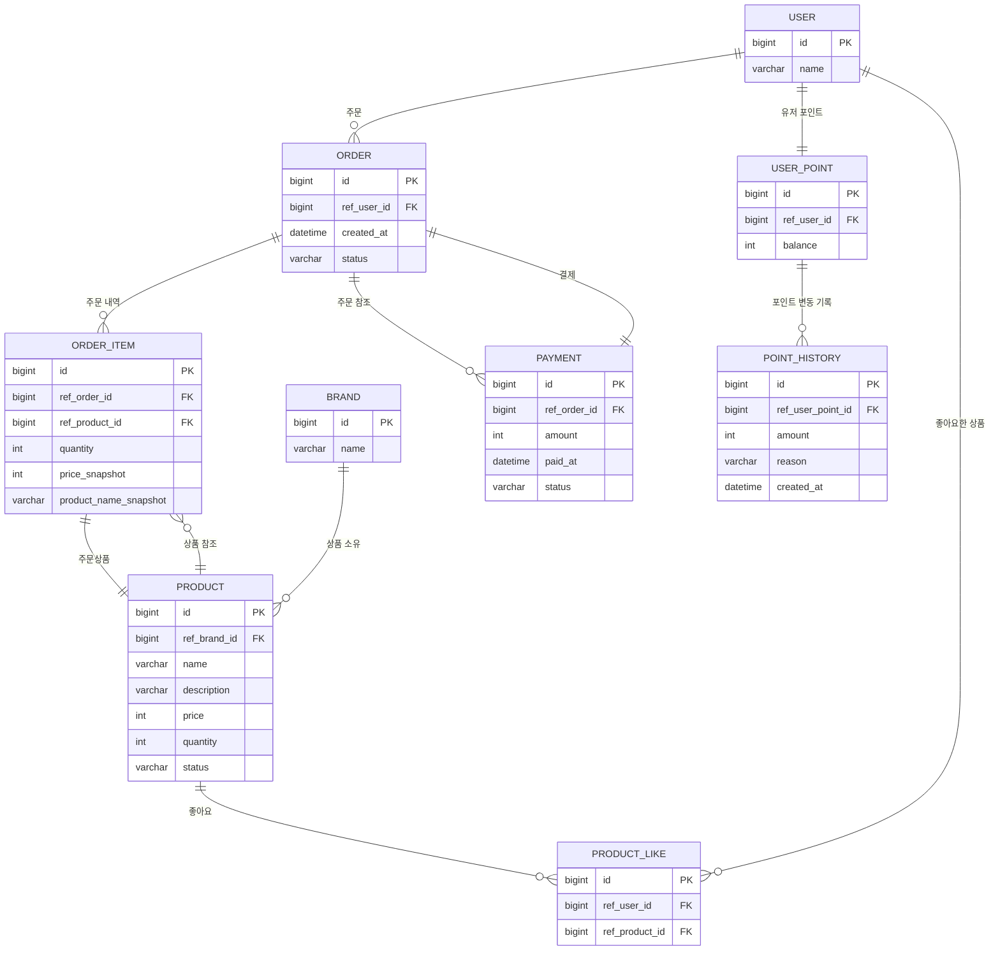

# ERD

---

- 모든 테이블은 `created_at`, `updated_at`, `deleted_at`(소프트삭제) 필드를 공통적으로 가집니다.  
  (ERD 복잡도 감소를 위해 아래 정의에는 생략)
- 모든 FK는 논리적 관계만 나타내며, 실제 FK 제약조건은 적용하지 않습니다.  
  (실무상 삭제/변경의 유연성을 위해 FK 제약을 두지 않음)

