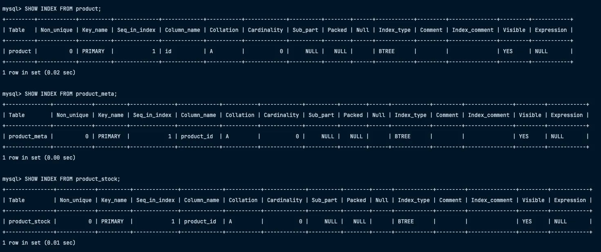
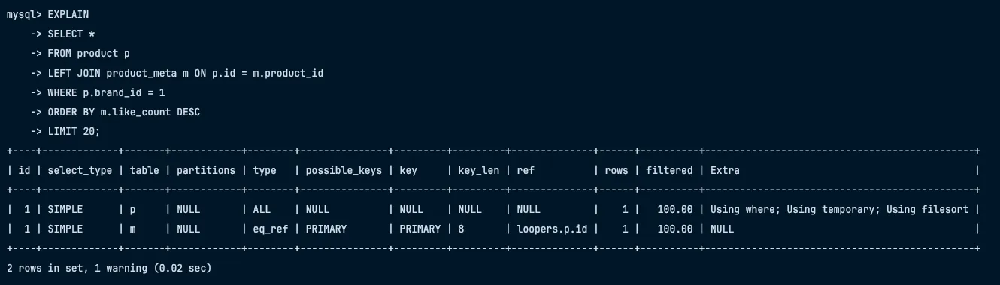
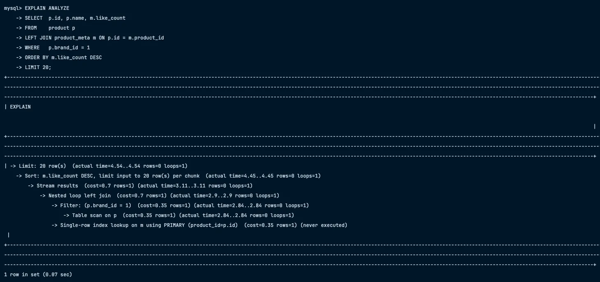
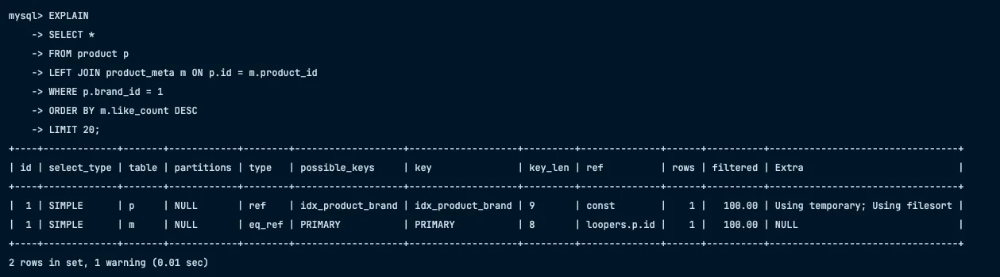
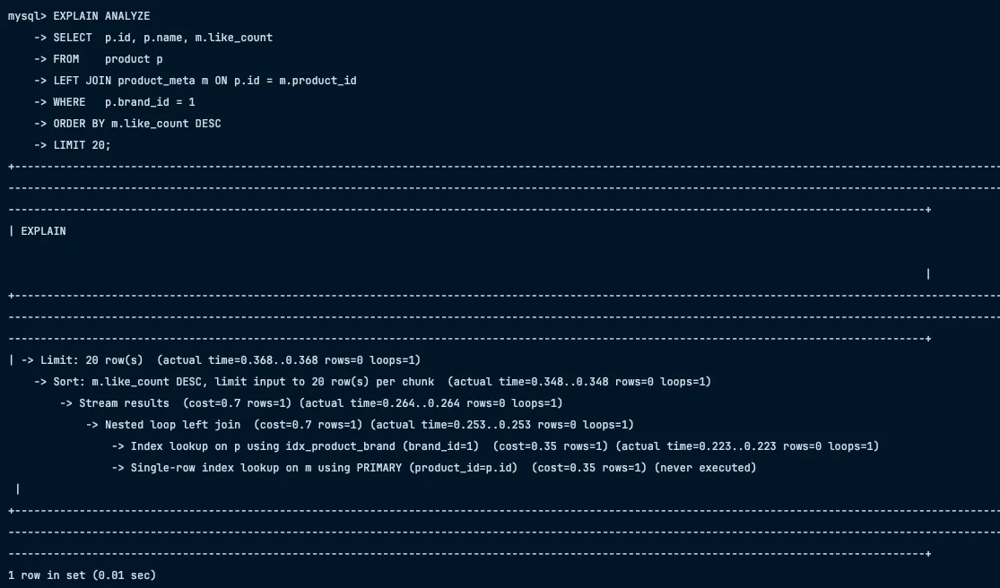
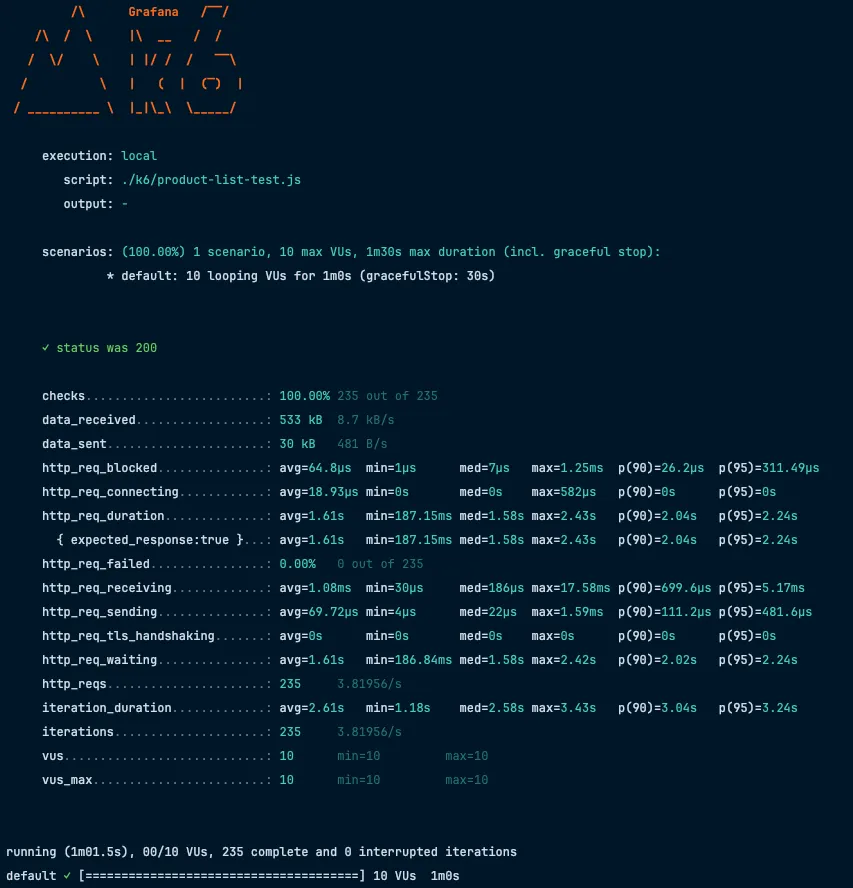
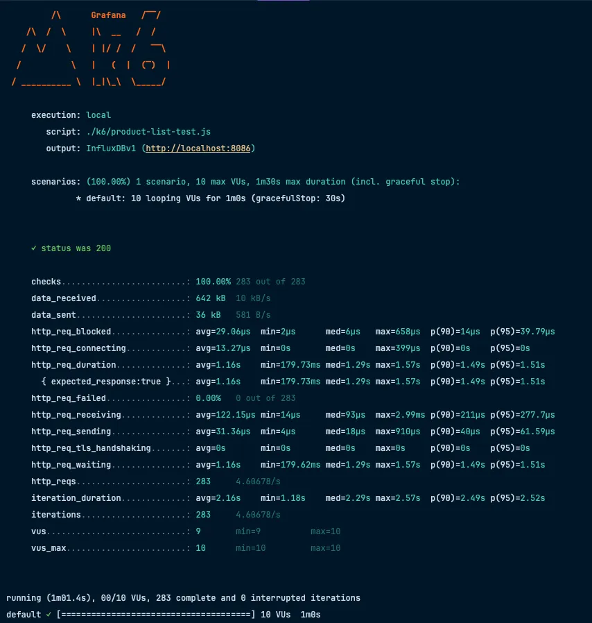
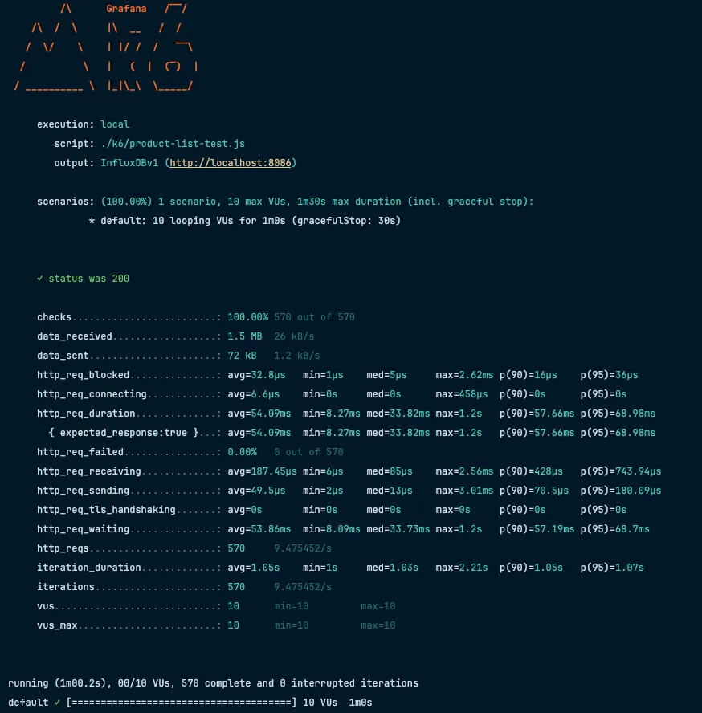
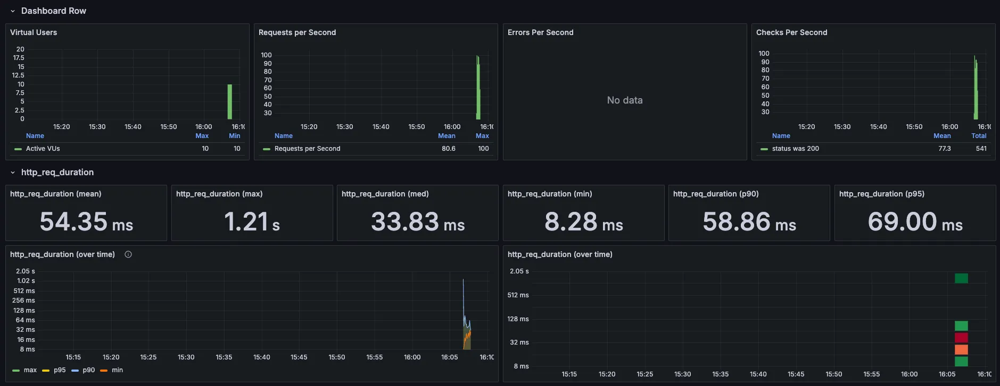
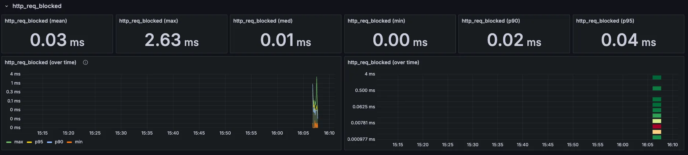

# ✅ 상품 목록 성능 개선 프로젝트 – 보고서

---

## 1. 인덱스 적용 전/후 성능 분석

### 1.1. **초기 상태 (인덱스 없음)**

- 상품 목록 API는 **brandId, 좋아요 순 정렬** 쿼리 모두 **풀스캔 + filesort**
- `EXPLAIN` 결과
    - `type=ALL`, `key=NULL`, `Using filesort`

<div align="center">
  
  
  
</div>

- **10만 row, 동시 10명 부하**
    - 평균 응답속도 **1.6초**, 95p **2.2초**, TPS **4~5**
    - 실서비스 기준 “사용 불가” 수준

---

### 1.2. **인덱스 적용**

- 인덱스 추가
  ```sql
  CREATE INDEX idx_product_brand ON product(brand_id);
  CREATE INDEX idx_meta_pid_like ON product_meta(product_id, like_count DESC);
  ```
- brandId 필터는 인덱스를 타고, 조인도 PK로 타지만  
  **정렬(ORDER BY m.like_count DESC)은 filesort가 남음**  
  (LEFT JOIN + ORDER BY 조합에서 MySQL 옵티마이저 한계)
- 그래도 **풀스캔 → ref scan**으로 대폭 개선

<div align="center">
  
  
</div>

---

### 1.3. **부하테스트 결과**

- **인덱스 적용 전**
    - 평균 **1.6초**, 최대 **2.4초**, TPS **4~5**

<div align="center">
  
</div>

- **인덱스 적용 후**
    - 평균 **1.16초**, 95p **1.51초**, TPS **4.6**

<div align="center">
  
</div>

---

## 2. 구조(Structure) 개선

- 상품 목록/상세 조회 시 **좋아요 수 포함, 좋아요 순 정렬**이 가능하도록  
  **Projection + DTO 구조 개선**
- **좋아요 등록/해제 시 like_count 동기화** 및  
  `@CacheEvict`로 상품 목록 캐시 무효화 처리

---

## 3. 캐시(Cache) 적용

- **RedisCacheManager + TTL 60초**로 상품 목록 캐시 적용
- `@Cacheable` / `@CacheEvict`로 캐시 미스/무효화 관리
- 캐시 미스 시에도 서비스는 항상 정상 동작
- **캐시 적용 후 부하테스트**
    - 평균 응답속도 **54ms**, TPS **9~10**
    - 실시간 서비스 수준 성능 확보

<div align="center">
  
  
  
</div>

---

## 4. 힘들었던 점 & 배운 점

- **초기 데이터 세팅**을 SQL로 하려다 DDL/제약조건/실행순서 등에서 많은 시간 소요  
  → 자바 더미데이터 제너레이터로 해결
- **Redis 캐시 직렬화/역직렬화**가 가장 어려움  
  → DTO/record 변환, 직렬화기 커스텀, 기본 String 직렬화의 안정성 체감
- **대량 데이터 insert 시 부팅 지연/캐시 빈값 이슈**  
  → 캐시 TTL/스케줄링, Pre-warm 전략 필요성 인지
- **실제 성능 개선은 인덱스/캐시/쿼리 구조의 조합에서 극적으로 나타남**  
  → 최적화 전후 k6+Grafana로 수치/그래프 캡처

---

## 5. 결론 및 추가 개선 방향

- **인덱스/캐시만으로도 웹 서비스의 실시간성과 확장성을 크게 높일 수 있음**
- **남은 과제**:
    - 캐시 Pre-warm
    - TTL/만료 후 자동 갱신
    - 캐시/DB 부하 동적 조절 등

---

### 📌 **전/후 비교 요약**

| 구분         | 인덱스/캐시 전 | 인덱스/캐시 후 |
|--------------|----------------|----------------|
| 평균 응답속도 | 1.2~1.6초      | 54ms           |
| 95p 응답속도 | 1.7~2.2초      | 69ms           |
| TPS          | 4~5            | 9~10           |
| 에러율       | 0%             | 0%             |

> “인덱스/캐시 적용 전에는 평균 응답속도 1.3초, 95%가 1.7초 이하로 매우 느렸으나,  
> 인덱스/캐시 적용 후 평균 54ms, 95%가 69ms 이하로 20배 이상 성능이 개선되었습니다.”
